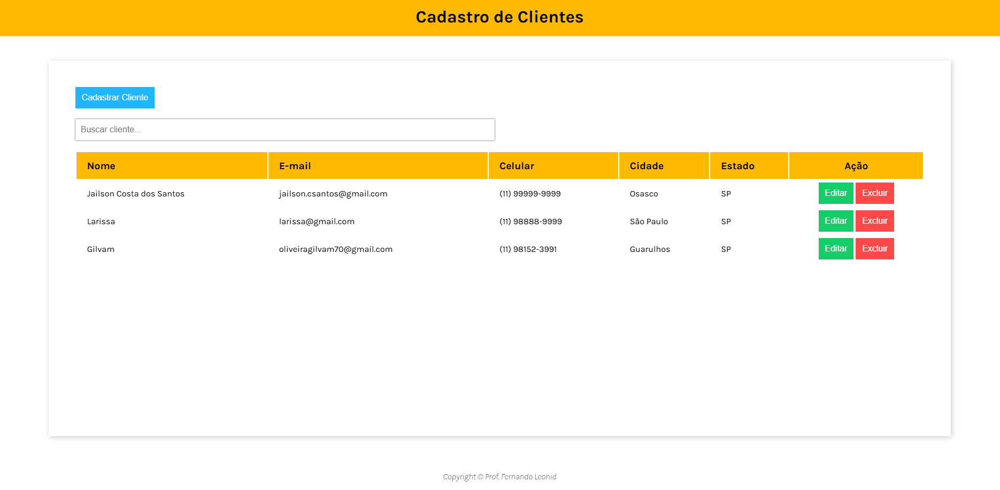

# Cadastro de Clientes (CRUD)

Aplicação web para **cadastrar, listar, editar e excluir clientes**, feita com HTML, CSS e JavaScript puro. Os dados ficam salvos no próprio navegador, usando `localStorage`.

🔗 **Demo online:** https://gilvamoliveira.github.io/CRUD/



## Funcionalidades

- **Cadastrar, editar e excluir** clientes (nome, e-mail, celular, cidade e estado), com confirmação antes de excluir
- **Busca** em tempo real por nome, e-mail, celular, cidade ou estado
- **Ordenação** da tabela ao clicar no cabeçalho de cada coluna (crescente e decrescente)
- **Máscara de celular** automática no formato `(11) 99999-8888`
- **Bloqueio de e-mail duplicado**, sem diferenciar maiúsculas de minúsculas
- **Proteção contra XSS**: os dados digitados são tratados antes de serem exibidos na tabela
- **Modal de cadastro** que fecha com o botão Cancelar, com o ✖ ou com a tecla `Esc`
- **Layout responsivo** para desktop e celular

## Tecnologias

- HTML5
- CSS3
- JavaScript (ES6+), sem frameworks
- `localStorage` para persistência dos dados
- GitHub Pages para a publicação

## Estrutura do projeto

```
CRUD/
├── index.html
├── main.js
└── css/
    ├── main.css
    ├── button.css
    ├── records.css
    └── modal.css
```

## Como rodar

1. Clone o repositório:
   ```bash
   git clone https://github.com/GilvamOliveira/CRUD.git
   ```
2. Abra a pasta `CRUD` e dê dois cliques no `index.html` (ou abra o arquivo no navegador).

Não precisa instalar nada.

## Observações

Como os dados ficam no `localStorage`, eles pertencem ao navegador e ao computador em que foram cadastrados. Limpar os dados do navegador apaga os clientes.

## Próximos passos

- Back-end com API REST e banco de dados, para substituir o `localStorage`

## Créditos

Projeto desenvolvido durante o curso, a partir do layout base do Prof. Fernando Leonid.

Melhorias e correções feitas por mim: busca, ordenação por coluna, máscara de celular, campo de estado, bloqueio de e-mail duplicado, proteção contra XSS e correção de bugs no fluxo de edição.

## Autor

**Gilvam Júnior Oliveira**

[LinkedIn](https://linkedin.com/in/gilvam-oliveira) · [GitHub](https://github.com/GilvamOliveira)